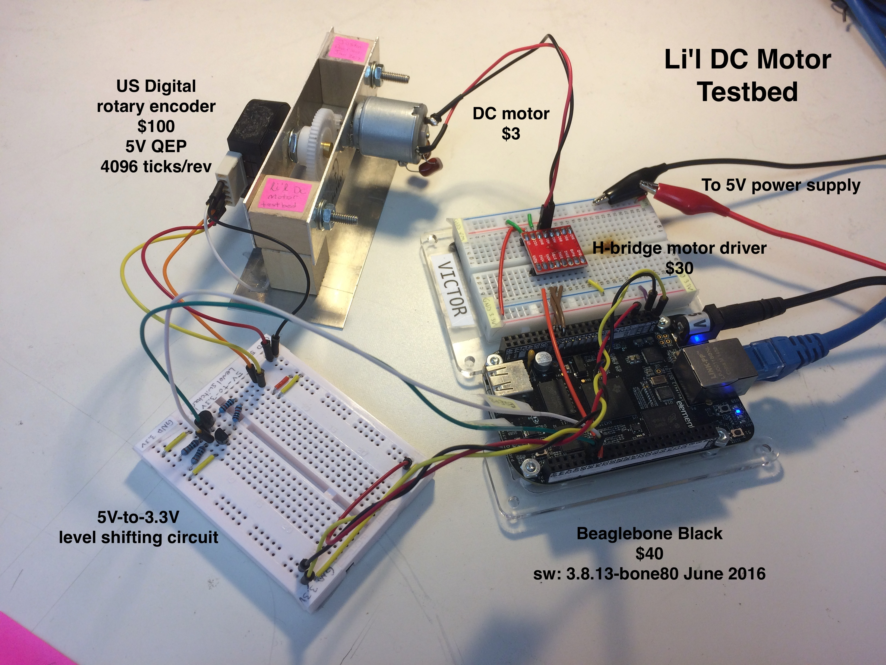

Drive a DC motor from the Beaglebone command line 
===================================================

Summary
--------

In this project the Beaglebone Black drives a DC motor with
pulse-width modulation through a motor driver, and measures the
motor's shaft angle with a rotary encoder that uses quadrature-encoded
pulses.

It does this entirely from the command line; there is no C or Python
code needed. This is possible because you can do I/O through special
files called "sysfs entries". For example, after loading the PWM
device-tree overlay (see below), you can set the PWM duty cycle and
period with

    echo 100000 > /sys/devices/ocp.3/pwm_test_P8_34.12/period  # nanosec
    echo  10000 > /sys/devices/ocp.3/pwm_test_P8_34.12/duty    # nanosec, this is actually 90% duty because of a bug in how the BBB's PWM polarity is set up.

See the Background section for more details on sysfs entries.

The script `run-lil-dc-motor.sh` shows how to configure the Beaglebone
Black to drive the DC motor and read its position with a rotary
encoder. The script does this:

- loads the PWM and EQEP device-tree overlays
- loads the GPIO sysfs entries
- runs the motor clockwise 
- runs the motor counter-clockwise
- sets PWM's "run" to 0 and motor driver's "standby" GPIO pin to low (standby)

Install
--------

Here is the hardware setup:

- $3 [DC motor from Sparkfun](https://www.sparkfun.com/products/11696)
  - 0-5V
  - Solder capacitors btwn terminals and case to reduce inductive kickback into BBB
    - Without them, sometimes BBB will hang when driving motor & reading ADCs
- $30 [Dual H-bridge motor driver from Sparkfun](https://www.sparkfun.com/products/9457) (model: TB6612FNG) 
- $100 [rotary encoder from US Digital](http://www.usdigital.com/products/encoders/incremental/rotary/shaft/S1) (model: S1-1024-250-NE-B-D)
  - Outputs 5V EQEP signal, 4096 EQEP ticks per rev
  - Use `bone_eqep1` device-tree overlay
- transistors for 5V-to-3.3V conversion between rotary encoder and BBB 

There is no software setup; just run `run-lil-dc-motor.sh`.

After the script runs, it will leave the PWM, EQEP, and GPIO sysfs entries enabled.

Background
------------

You can control various peripherals on the Beaglebone Black from the
command line. For example, to configure pin `P9_31` as an output and
set it high (3.3V), do this:

    echo 110   > /sys/class/gpio/export   
    echo "out" > /sys/class/gpio/gpio110/direction
    echo 1     > /sys/class/gpio/gpio110/value
    
The number `110` is the number of the GPIO that's wired up to header
pin `P9_31`. The mapping between BBB header pins (`P9_31`) and GPIO
numbers (`110`) is weird, see [Derek Molloy's Exploring Beaglebone
Figures](http://exploringbeaglebone.com/chapter6/) ([pdf
1](http://exploringbeaglebone.com/wp-content/uploads/resources/BBBP8Header.pdf),
[pdf
2](http://exploringbeaglebone.com/wp-content/uploads/resources/BBBP9Header.pdf))

Line 1 creates `/sys/class/gpio/gpio110/` with various files inside
like `direction` and `value`. They are not "real" files on disk; the
kernel catches reads/writes to the files inside `gpio110/` and invokes
a special kernel module to interact with the GPIO hardware. This
method of interfacing with hardware is called "sysfs".

Line 2 writes the string "out" to the `direction` sysfs file. This
causes the GPIO kernel module to configure the GPIO as an output.

Line 3 write the string "1" to the `value` sysfs file. This causes the
GPIO KM to set the GPIO to 3.3V (high).

Notes
-------

- I should probably run both H-bridges in parallel. The driver is rated
for 1A continuous, 3A peak, but with 5V across the 2.5-Ohm motor coils
we're pushing it.

- Beaglebone software version:

    # uname -a
    Linux beaglebone 3.8.13-bone80 #1 SMP Wed Jun 15 17:03:55 UTC 2016 armv7l GNU/Linux

Credits
--------

Justin Pearson, Jan 2017
